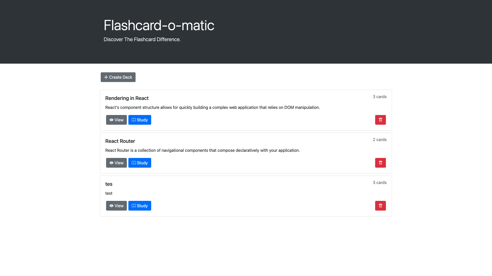
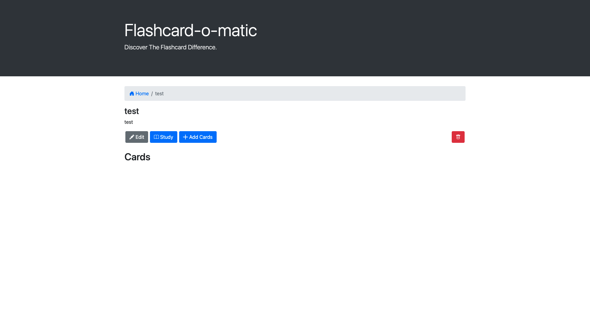
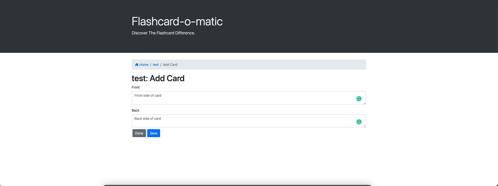
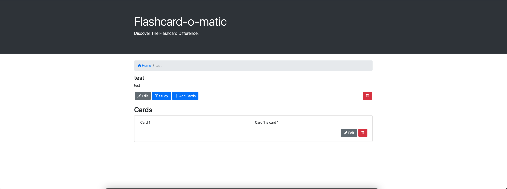

# Flash Cards

> Link to live app: https://flashcards-xi.vercel.app/

### Overview

React flashcards was designed to be utilized as a tool for users to learn React. It allows a user to create a card deck with certain topics, and then create new cards to add to that set. If the card deck is related to Functional Components, the cards added to the deck would contain questions about the topic on one side of the card, on the other, there is an answer. 

### Dashboard

The main url will always redirect to the overall stats of the library where you can easily identify the overall status of the library.

### Create Deck /new

This page will redirect the user to the /new router, and give them the ability to create a new card deck.

### Created Deck

Once the card has been created, the user will be redirected to the newly created card set where they have the option to start adding new cards to the set

###  Adding Cards To The Set

Once the user created a new card they will be redirected to this page where they will be able to add the properties for the new card

### Created Card 

After succesfully creating a new card the user will be redirected back to the card set dashboard along with the newly created card

### Created 

Once the card has been created, the user will be redirected to the newly created card set

