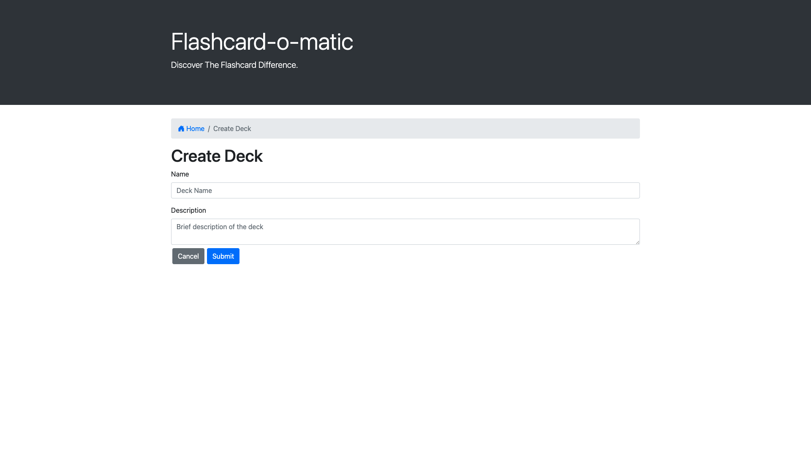

# Flash Cards

> Link to live app: https://tender-easley-433635.netlify.app/

### Overview

React flashcards was designed to be utilized as a tool for users to learn React. It allows a user to create a card deck with certain topics, and then create new cards to add to that set. If the card deck is related to Functional Components, the cards added to the deck would contain questions about the topic on one side of the card, on the other, there is an answer. 

### Dashboard

The main url will always redirect to the overall stats of the library where you can easily identify the overall status of the library.

### Create Deck /new

This page will redirect the user to the /new router, and give them the ability to create a new card deck.

### Created 

Once the card has been created, the user will be redirected to the newly created card set

## Learning Objectives For This Project

This project is designed to test ones ability to work with *rendering* and *state management* using *React*

* Installing packages via NPM

* Running tests from the command line

* Writing React function components

* Creating routes, including nested routes, using *React Router*

* Using hooks like **useState()**, **useParams()**, and **useHistory()**

* Debugging React code through console output and using the VS Code debugger.
